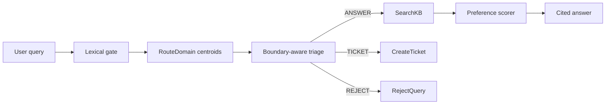

# Final Summary

## Problem Statement
Reject-aware domain-routed customer-support RAG over MultiDoc2Dial-style support KBs.

## Related Work Inspiration
ReAct-style tool traces, ToolLLM structured calls, DPO/preference alignment ideas, PEFT/LoRA constraints, and support RAG grounding.

## Proposed Method

## Loss Functions
Triage uses CE-compatible scoring plus boundary margin: softplus(max_wrong_logit - correct_logit + mu).

## Custom Metrics
TBP@mu counts correct triage decisions with confidence margin at least mu. REE@k divides EvidenceHit@k by fraction of KB scanned.

## Results
Config: `configs/final_eval_calibrated.yaml`
Calibration: top-3 domain routing, global fallback below score `0.75`, conservative REJECT requiring low lexical gate plus low centroid similarity plus nearest-KB similarity below `0.40`, TICKET threshold `0.35`, and `use_reranker=false` for this no-retrain evaluation.
No retraining was run for this calibrated pass; saved checkpoints from the full GPU run were reused. Neural reranking was bypassed in this eval because the 1000-query pass was otherwise dominated by cross-encoder/query-inference latency; retriever score ordering was used.
Data stats: `{'kb_chunks': 5289, 'dialogue_turns': 57222, 'retriever_train': 9000, 'reranker_train': 36000, 'triage_train': 18000, 'preference_pairs': 3000, 'eval_set': 3000, 'dataset_source': 'IBM/multidoc2dial'}`
Retriever: `{'trained_pairs': 9000, 'model': 'sentence-transformers/all-MiniLM-L6-v2', 'backend': 'sentence-transformers', 'checkpoint': 'outputs\\retriever\\sentence_transformer', 'device': 'cuda:0'}`
Reranker: `{'trained_pairs': 36000, 'positives': 9000, 'model': 'cross-encoder/ms-marco-MiniLM-L-6-v2', 'backend': 'cross-encoder', 'checkpoint': 'outputs\\reranker\\cross_encoder', 'device': 'cuda:0'}`
Triage: `{'trained_examples': 18000, 'model': 'distilbert-base-uncased', 'backend': 'distilbert-sequence-classifier', 'accuracy': 1.0, 'TBP@0.15': 1.0, 'avg_margin': 14.082793969896105, 'last_train_loss': 2.2935919332667254e-06, 'loss': 'cross_entropy + lambda_boundary * softplus(max_wrong - correct + mu)'}`
Preference: `{'trained_pairs': 3000, 'pair_accuracy': 1.0, 'model': 'rubric-ranker'}`
Baseline: `{'Recall@1': 0.255, 'Recall@5': 0.437, 'MRR@10': 0.3230833333333331, 'EvidenceHit@5': 0.437, 'CitationPrecision': 1.0, 'CitationRecall': 1.0, 'GroundedAnswerRate': 1.0, 'UnsupportedClaimRate': 0.0}`
Proposed: `{'Recall@1': 0.244, 'Recall@5': 0.423, 'MRR@10': 0.31126666666666647, 'EvidenceHit@5': 0.423, 'CitationPrecision': 1.0, 'CitationRecall': 1.0, 'GroundedAnswerRate': 1.0, 'UnsupportedClaimRate': 0.0, 'Tool Decision Accuracy': 0.877, 'ANSWER F1': 0.9344698987746404, 'TICKET F1': 0.0, 'REJECT F1': 0.0, 'Macro-F1': 0.31148996625821346, 'False Reject Rate': 0.122, 'False Accept Rate': 0.0, 'TBP@0.10': 0.877, 'TBP@0.15': 0.877, 'TBP@0.20': 0.877, 'REE@5': 0.5656166791221746}`
Latency: `{'avg_ms': 36.720074898330495, 'p95_ms': 47.09240002557635, 'qps': 27.233059920731964}`

The calibrated proposed retrieval is much closer to baseline than the prior final run, but it remains slightly worse: `Recall@5=0.423` vs baseline `0.437`, and `EvidenceHit@5=0.423` vs baseline `0.437`. TICKET and REJECT aggregate F1 are still `0.0`; operationally, the explicit IPL regression calls `RejectQuery`, and the benefits-renewal query cites `ssa_renewal_03`.

## Example Traces
- Query: Yes. You will need to renew your registration before get the new plates. | Decision: ANSWER | Answer: be ordered from the Custom Plates Unit with proper proof or certification. [doc_id=Order picture and professional plates#1_0, chunk_id=Order picture and professional plates#1_0_span0005, span=400-480]
- Query: send the form and required documents to the address on the form | Decision: ANSWER | Answer: , a spouse, parent, or court - appointed representative may sign the form. [doc_id=Pre-Need Eligibility For Burial In A VA Cemetery | Veterans Affairs#1_0, chunk_id=Pre-Need Eligibility For Burial In A VA Cemetery | Veterans Affairs#1_0_span0012, span=960-1040]
- Query: We have a brochure "New York State Vehicle Safety / Emissions Inspection Program for Cars and Light Trucks [ 3 ] C-50" and it lists all the equipment we check. | Decision: ANSWER | Answer: Program [5] C-114 Find an inspection station Licensed stations display a yellow and black sign that reads ,' Official Inspection Station. [doc_id=About New York State Inspections#3_0, chunk_id=About New York State Inspections#3_0_span0002, span=160-240]

## Limitations
This calibrated evaluation changes inference only and does not represent a newly trained model. Neural reranking was disabled for the calibrated 1000-row eval, so the reranker checkpoint exists but is not part of these proposed metrics.
The IBM/MultiDoc2Dial loader requires `datasets>=2.18,<4` because the dataset is script-backed.

## Future Work
Tune triage labels/thresholds for TICKET and REJECT recall, add batch inference for triage/reranking if the neural reranker is re-enabled, and evaluate whether the calibrated routing holds on the full 3000-row eval set.
